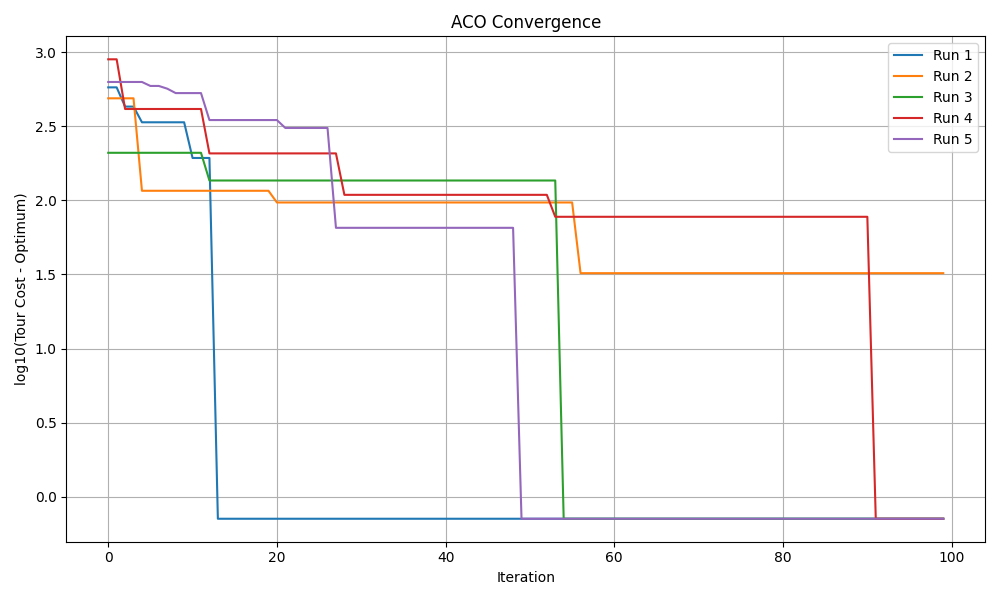
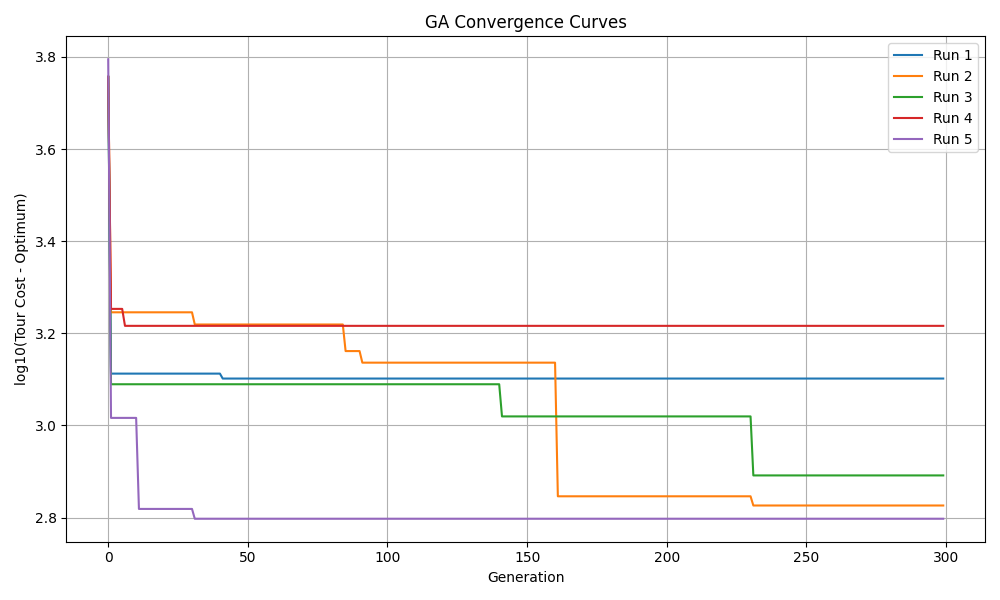
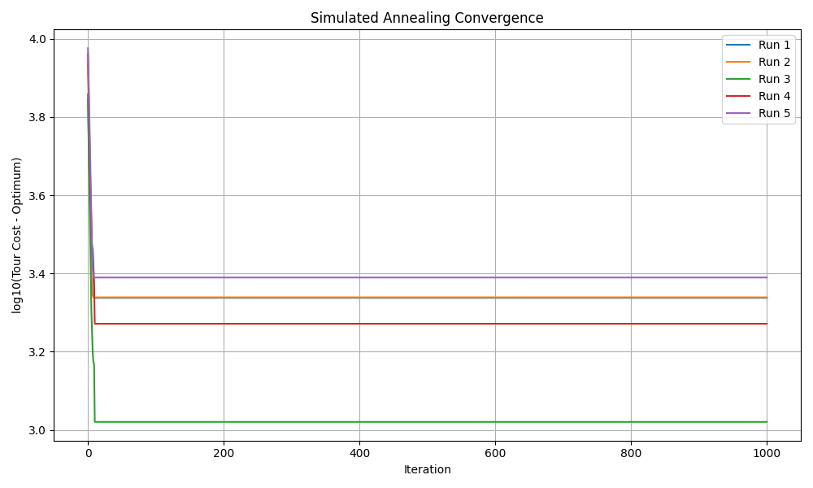

# TSP Metaheuristics (SA, GA, ACO)

Metaheuristic TSP solvers with 2-opt optimization and convergence analysis on TSPLIB att48.

---

## Overview

This project implements and benchmarks three metaheuristic algorithms for the Traveling Salesperson Problem (TSP):

- Simulated Annealing (SA)
- Genetic Algorithm (GA)
- Ant Colony Optimization (ACO)

All methods are evaluated on the TSPLIB att48 dataset with convergence analysis, runtime comparison, and solution quality evaluation.

---

## Highlights

- Integrated 2-opt local search to improve solution quality
- JIT-accelerated cost evaluation (Numba) for GA
- Probabilistic pheromone update with bounded search in ACO
- Multi-run evaluation (5 runs) for robustness analysis

---

## Results (att48)

| Algorithm | Best Cost | Avg Cost | Runtime |
|----------|----------|----------|--------|
| ACO      | 33523.71 | 33530.02 | 124.5s |
| GA       | 34150.32 | 34520.29 | 0.73s  |
| SA       | 34230.53 | 34854.55 | 6.89s  |

---

## Convergence

### ACO


### GA


### SA


---

## Usage

```bash
python aco.py
python ga.py
python sa.py
